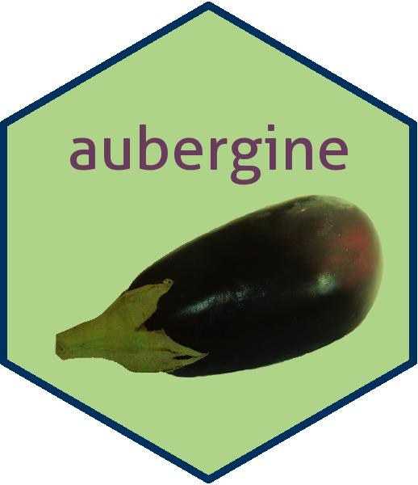

# aubergine



A package with teaching material for dynamic simulations in **R**.

The package is created with the **learnr** package.

## Installation

```
devtools::install_github(‘dynamic-R/aubergine’, depend=TRUE)
```

---
2021-07-13
