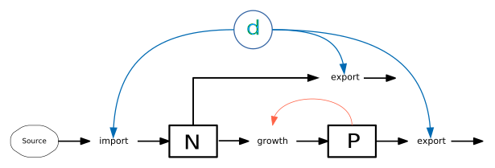

```{r setup, include=FALSE}
knitr::opts_chunk$set(echo = TRUE)
library(learnr)
library(deSolve)
library(rootSolve)
```




* $N$ nutrient, e.g. phosphorus (mmol P / m3)
* $P$ phytoplankton, carbon (mmol C / m3)

---

## Introduction

The example shows a chemostat model [cf. @Novick1950;@Herbert1956] by example of heterotrophic or autotrophic organisms (bacteria, algae, $P$), where growth is limited by a single nutrient (e.g. phosphorus, $N$) via a Monod equation.

We use here a notation, compatible with the so-called NPZ and NPZD models where $N$ 
is a nutrient (nitrogen or phosphorus), $P$ is phytoplankton, $Z$ zooplankton and optionally
$D$ detritus. Please don't get confused! Here **P** is phytoplankton and not phosphorus, while
the symbol for the nutrient **N** does not necessarily mean that it is nitrogen.

## Implementation

The system is solved numerically with solvers from package **deSolve** [@Soetaert2010a], while equilibria at infinite time are estimated with package **rootSolve** [@Soetaert2009]. The implementation follows the standard formulation of these packages, see package documentation of **deSolve** and **rootSolve**, and @Soetaert2010a or @Soetaert2010c for details. 
The code is written in the **R** programming language for statistical computing [@RCore2018].

### The code

```{r, chemostat}
library("deSolve")
library("rootSolve")

chemostat <- function(time, y, parms) {
  with(as.list(c(y, parms)), {
    p_growth <- r_pgrow * N / (km_n + N) * P
    n_import <- d * N0
    n_export <- d * N
    p_export <- d * P
    
    dN_dt   <- n_import - c_pn * p_growth - n_export
    dP_dt   <-                   p_growth - p_export
    list(c(dN_dt, dP_dt), p_growth = p_growth)
   })
}
parms <- c(
  r_pgrow = 0.5,   # phytoplankton growth parameter (1/d)
  km_n    = 1.0,   # half saturation constant, P (mmol/m3)
  c_pn    = 1/106, # stoichiometric conversion from phosporus P to phyto C (P:C ratio)
  d       = 0.1,   # dilution rate 1/d
  N0      = 5      # P in inflow (mmol/m3)
)
times <- seq(0, 40, length.out=100)  # simulation time (d)
y  <- c(N = 5, P = 1)     # Nutrient (phosphorus) N and Phytoplankton carbon (mmol/m3)
```

### Dynamic simulation

A dynamic simulation can then be performed by function `ode`, using the default algorithm `lsoda` with automatic integration step size. The result (`out`) is then a matrix-like object of class `deSolve` that is supported by a generic (i.e. object oriented) plot function.

```{r, single, , fig.height=3, fig.width=8}
out <- ode(y, times, chemostat, parms)
plot(out, mfrow=c(1, 3))
```

## Role of initial values

Let's play around with the model and change some values. First let's modify  
the initial values `y <- c(N = 5, P = 1)`:

* Set `N`utrient and/or `P`hytoplankton to smaller or bigger values.
* Set `P`hytoplankton to zero.
* If necessary, change the time period.

```{r, chemostat-ex1, exercise=TRUE, exercise.lines = 28, fig.height=3, fig.width=8}
<<chemostat>>
out <- ode(y, times, chemostat, parms)
plot(out, mfrow=c(1, 3))
```

```{r chemostat-ex1-question, echo=FALSE}
ans <- "The equilibrium is independent on initial states, except 
    if initial phytoplankton P is zero. As in reality, nothing can grow without an inoculum"
question("How do the initial values influence the final state?",
  answer("The final state depends on the initial states"),
  answer("The final state is independent on initial states, except `P=0`", correct = TRUE),
  answer("Initial state influence time until equilibrium", correct = TRUE),
  incorrect = ans,
  correct=ans,
  allow_retry = TRUE
)
```

## Role of the dilution rate $d$

Let's now observe the influence of the dilution rate `d`:

* Set `d=0`, what does this mean?
* Set `d=0.5` what do you observe?
* Find a good value for `d` 

```{r, chemostat-ex2, exercise=TRUE, exercise.lines = 28, fig.height=3, fig.width=8}
<<chemostat>>
test_parms <- parms
test_parms["d"] <- 0.1
out <- ode(y, times, chemostat, test_parms)
plot(out, mfrow=c(1, 3))
```

```{r chemostat-ex2-question, echo=FALSE}
ans <- "The chemostat can be run from `d=0` (batch) up to `d < r_pgrowth` (the maximum growth rate).
  If dilution exceeds growth, phytoplankton dies out."
question("What limits the range of sensible dilution parameters?",
  answer("The dilution rate must be > 0."),
  answer("A dilution rate of zero is equivalent to a batch.", correct = TRUE),
  answer("If the dilution rate exceeds max growth rate, phytoplankton dies out.", correct = TRUE),
  incorrect = ans,
  correct=ans,
  allow_retry = TRUE
)
```


## Solution: Scenarios with different patterns

Here we see some examples with different $d$. We see also that the plot function 
allows to show several scenarios simultanaeously:

```{r, multiple, fig.height=4, fig.width=8}
y  <- c(N=5, P=1)
p1 <- p2 <- p3 <- parms
p1["d"] <- 0; p2["d"] <- 0.3; p3["d"] <- 0.5
out  <- ode(y, times, chemostat, parms)
out1 <- ode(y, times, chemostat, p1)
out2 <- ode(y, times, chemostat, p2)
out3 <- ode(y, times, chemostat, p3)

plot(out, out1, out2, out3, which=c("N", "P"))
```

## Steady State

In the sections above, we could see how the chomostat model approaches an 
equilibrium. As the model is very simple, the equilibrium can be calculated
analytically by setting both state equations to zero and then solving the
system of equations. The solution can then be plotted:


```{r analytical, fig.height=3, fig.width=8}
d <- seq(0, 0.6, length.out = 100)
r <- 0.5;  kp <- 0.5; Y = 106; N0 = 5
 
N <- d * kp / (r - d)
N <- ifelse(d > (r * N0)/(kp + N0), N0, N)
 
P <- Y * (N0 - N)
 
par(mfrow=c(1, 3))
plot(d, N,     type="l")
plot(d, P,     type="l")
plot(d, N * P, type="l")
```

Here we see that with increasing $d$ the equilibrium phytoplankton concentration 
decreases and more nutrients are left over. The production, however (d*P) 
approaches an optimum at high dilution rates. If the dilution exceeds maximum
growth, the chemostat dies out.

## Steady state solved numerically

To gain better understanding, we now want to re-create the curves above numerically 
by simulation. For this purpose, we may simulate the model for a long time
until we see an equilibrium visually and then take the last values.

But, as this is of course not very efficient, the equilibrium can also aproximated 
numerically with package **rootSolve**. 

We first create a data frame, where the first column is a sequence of 
dilution rates within asensible range. The other two columns are then reserved
for storing the results.

```{r, steadystate, exercise=TRUE, exercise.lines=30, fig.height=3, fig.width=8}
<<exercise>>
state <- data.frame(
  d = seq(0.01, 0.5, length.out = 100),
  N = 0,
  P = 0
)

## example how to calculate a single equilibrium

parms["d"] <- state$d[5]
times <- c(0, Inf)
out <- runsteady(y, times, chemostat, parms)
out$y

## place a loop here to fill the data frame .............

## and then outcomment the plot
#par(mfrow = c(1, 3))
#plot(N     ~ d, data = state, type = "l")
#plot(P     ~ d, data = state, type = "l")
#plot(N * P ~ d, data = state, type = "l")
```


```{r, steadystate-hint, fig.height=3, fig.width=8}
for (i in 1:nrow(state)) {
  parms["d"] <- state$d[i]
  times <- c(0, Inf)
  out <- runsteady(y, times, chemostat, parms)
  state[i, 2:3] <- out$y
}

par(mfrow = c(1, 3))
plot(N     ~ d, data = state, type = "l")
plot(P     ~ d, data = state, type = "l")
plot(N * P ~ d, data = state, type = "l")
``` 

We use a loop here for simplicity, even if list-based approaches (e.g. `lapply`) 
may appear as more elegant for the intermediate and advanced **R** user.


## References

<div id="refs"></div>

----
