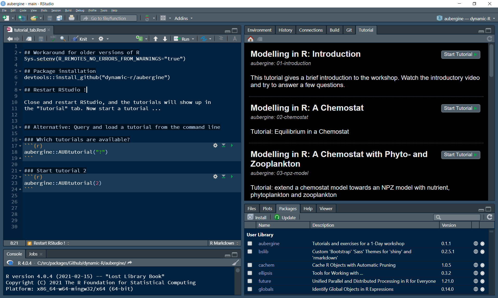
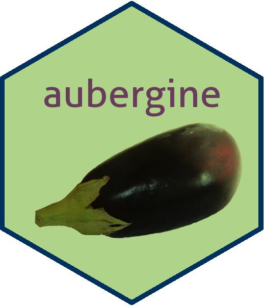

```{r setup, include=FALSE}
knitr::opts_chunk$set(echo = TRUE)
#library(learnr)
```


## Tutorial

This tutorial was developed as didactic resource for the
\href{https://aquaticdatasciopensci.github.io/}{AEMON-J} workshop 
in 2021. We aim to develop this package further after the workshop, so your 
feedback is welcome.

We recommend to 

* watch the introductory video first: https://youtu.be/L_zL_D1Qmjc

* If you prefer reading, you can find the slides under [this
link](https://dynamic-r.github.io/hacking-limnology/).

Then you can go through the tutorials. They are included in two versions:

* Intereactive tutorials using the **learnr** package. They can be run in RStudio
  or placed on a "shiny" server.
* Static versions of the tutorials as package vignettes. The tutorials can
  be read with any R Gui (including but not limited to RStudio) and also read
  online with a web browser. Direct access to RMarkdown and R source code is 
  provided in the help index of the package.

## Installation

```{r eval=FALSE}
install.packages("devtools") # if it is not yet installed
devtools::install_github("dynamic-R/aubergine", depend=TRUE)
```

### Installation on older versions of R

Package installation from Github is sometimes strict, if installation is done 
on an older **R** version, but some packages were created with a newer version,
e.g. installation of **learnr** 
built on **R** 4.0.5  on an older **R** version, e.g. 4.0.4.

If installation fails under such circumstances, use the following 
workaround, so that the (in this case unproblematic) warnings 
will not throw an error:

```{r eval=FALSE}
install.packages("devtools") # if it is not yet installed
Sys.setenv(R_REMOTES_NO_ERRORS_FROM_WARNINGS="true")
devtools::install_github("dynamic-R/aubergine", depend=TRUE)
```

## Start of a Tutorial

Close and **restart** RStudio (!) and the tutorial will show up
in the "Tutorial" tab. Select a tutorial and start ...

{width=70%}


## Uninstall

To uninstall **aubergine**, you can use the "Packages" tab in Rstudio. 
Locate the package and select the "x" button at the right margin.

To uninstall manually, use:

```{r eval=FALSE}
remove.packages("aubergine", lib="~/R/win-library/4.1")
``` 

... given that the package was installed with default settings 
as a non-administrative user.


  
## The name of the package

We tried to find a package name and had lots of fun with different ideas. Then
we considered to call it after a vegetable and finally choose **aubergine*"**. 
It had no special reason, but we can of course give a post-hoc explanation:

An aubergine (*Solanum melongena**), also called "eggplant" is a visually very 
atractive fruit. It is not edible in raw form, 
"but it becomes tender when cooked and develops a rich, complex flavor. Rinsing, draining, and salting the sliced fruit before cooking may remove the bitterness. The fruit is capable of absorbing cooking fats and sauces, which may enhance the flavor of eggplant dishes" [@wikipedia_eggplant], [@bbc_eggplant].

This can be seen as a metaphor for working with models. Have fun!

{width=20%}

## References

<div id="refs"></div>

----

